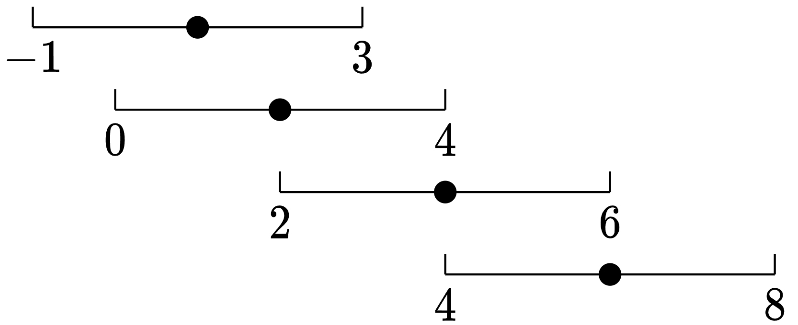

# 数组的最大美丽值

## 题目描述

给你一个下标从 `0` 开始的整数数组 `nums` 和一个 非负整数 `k`。

在一步操作中，你可以执行下述指令：

在范围 `[0, nums.length - 1]` 中选择一个 此前没有选过的下标 `i` 。
将 `nums[i]` 替换为范围 `[nums[i] - k, nums[i] + k]` 内的任一整数。
数组的`美丽值`定义为数组中由相等元素组成的最长子序列的长度。

对数组 `nums` 执行上述操作任意次后，返回数组可能取得的最大美丽值。

注意：你只能对每个下标执行一次此操作。

数组的子序列定义是：经由原数组删除一些元素（也可能不删除）得到的一个新数组，且在此过程中剩余元素的顺序不发生改变。

 示例 1：
输入：`nums = [4,6,1,2]`, `k = 2`
输出：`3`
解释：在这个示例中，我们执行下述操作：
- 选择下标 `1` ，将其替换为 `4`（从范围 `[4,8]`中选出），此时 `nums = [4,4,1,2]` 。
- 选择下标 `3` ，将其替换为 `4`（从范围 `[0,4]` 中选出），此时 `nums = [4,4,1,4]` 。
执行上述操作后，数组的美丽值是 `3`（子序列由下标 `0 、1 、3` 对应的元素组成）。
可以证明 `3` 是我们可以得到的由相等元素组成的最长子序列长度。

示例 2：
输入：`nums = [1,1,1,1], k = 10`
输出：`4`
解释：在这个示例中，我们无需执行任何操作。
数组 `nums` 的美丽值是 `4`（整个数组）。

## 题解
- 本题难度较大，没有思路，甚至题目都看不太懂，直接分析`0x3f`的题解。
```
1.由于选的是子序列，且操作后子序列的元素都相等，所以元素顺序对答案没有影响，可以先对数组排序。
```
- 判断是否能排序，就看元素的顺序对答案有没有影响。但是为什么要进行排序呢，要结合下面的解题思路来看
```
2.示例 1 排序后 nums=[1,2,4,6]。由于每个数 x 可以改成闭区间 [x−k,x+k] 中的数，我们把示例 1 的每个数看成闭区间，也就是
```

```
3.题目要求的「由相等元素组成的最长子序列」，相当于选出若干闭区间，这些区间的交集不为空。
```
- 每一个数字在区间`[x−k,x+k]`内都是可变的，因此用区间表示当前元素。美丽值，实际上就是找一个子数组，其内部元素的值全部相等，并且这个子数组的长度最大。
- 那么将元素表示为区间之后，就是看区间是否有交集，有交集表示可以构成元素相等的子数组，那么问题就转化为了求区间交集的最大长度。
```
排序后，选出的区间是连续的，我们只需考虑最左边的区间 [x−k,x+k] 和最右边的区间 [y−k,y+k]，如果这两个区间的交集不为空，那么选出的这些区间的交集不为空。也就是说，要满足
    x+k≥y−k
即
    y−x≤2k
```
- 接下来我们需要确定满足条件的临界值，最长的子数组，其`max`和`min`元素所在的区间一定是有交集的,也就是`y−x≤2k`。
```
于是原问题等价于：
排序后，找最长的连续子数组，其最大值减最小值不超过2k。
```
- 这样等价之后就可以在原数组上进行滑动窗口，而不需要考虑区间。
- 滑动窗口三要素：左右端点初始化在哪，左右端点如何移动以及答案如何更新。
- 本题`ans`最小值为0，即左右端点全部从`0`开始；`当nums[right]−nums[left]>2k`，就移动左端点`left`;左端点停止移动时，下标在`[left,right]`的子数组就是满足要求的子数组，用子数组长度`right−left+1`更新答案的最大值。
```python
    left = ans = 0
    for right in range(len(nums)):
        while nums[right] - nums[left] > 2 * k:
            left += 1
        ans = max(ans, right - left + 1)
```

