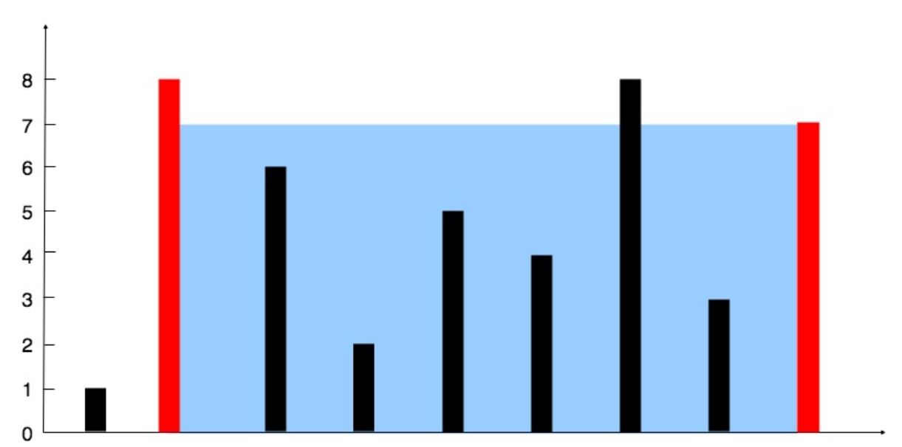

# 盛最多水的容器

## 题目描述

给定一个长度为 `n`的整数数组 `heigh`t 。有 `n` 条垂线，第 `i` 条线的两个端点是 `(i, 0)` 和 `(i, height[i])` 。

找出其中的两条线，使得它们与 `x`轴共同构成的容器可以容纳最多的水。

返回容器可以储存的最大水量。

说明：你不能倾斜容器。

## 示例

```
输入：`[1,8,6,2,5,4,8,3,7]`
输出：`49`
```

## 解题思路
- 示意图如下

- 首先围成的面积是两个线中较短的一个与下标之差的乘积，因此我们需要遍历数组，找到最大的面积
- 首先设置两个指针，一个指向数组的第一个元素，一个指向数组的最后一个元素，然后计算面积，如果面积大的话就更新最大面积，然后移动较短的那个指针，因为移动较长的那个指针的话，面积只会变小，而移动短指针，内部还可能有更高的
- 时间复杂度：花费O(1)的时间知道O(1)的信息，因此是O(n)，空间复杂度是O(1)
